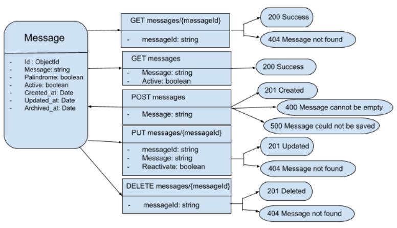

This project manages messages and provides details about those messages, specifically whether or not a message is a palindrome. It supports the following operations:

• Create, retrieve, update, and delete a message

• List messages

## Running the application

From the root folder run `docker-compose up` to start MongoDb

On a separate terminal, run `yarn install`, `yarn build` and `yarn start`

For running queiries against the API, you can access the swagger page at http://localhost:3000/docs/

## Design document

Check the diagram below:

The message is stored in a MongoDb collection called `qlik_dev` and has the properties shown above. The API responses show the appropriate status codes. All the APIs are accompanied by their respective unit tests.
